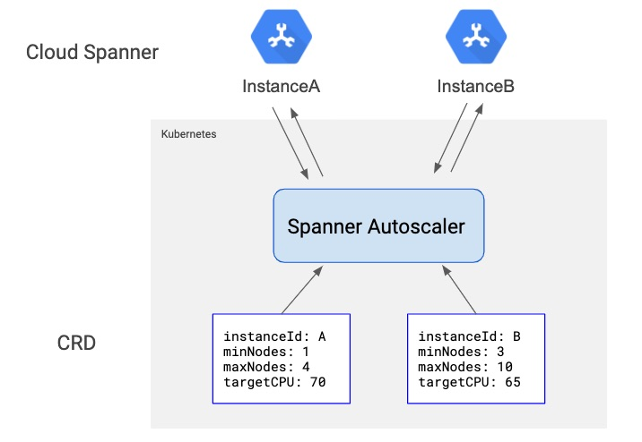
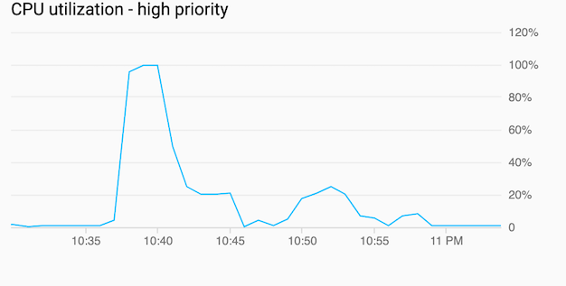
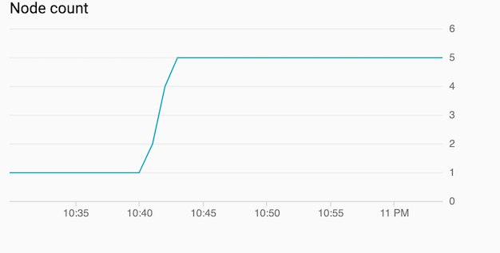
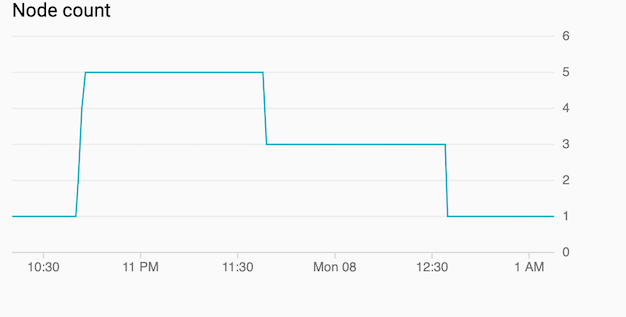

# Spanner Autoscaler

[![actions-workflow-test][actions-workflow-test-badge]][actions-workflow-test]
[![release][release-badge]][release]
[![license][license-badge]][license]

Spanner Autoscaler is a [Kubernetes Operator](https://coreos.com/operators/) to scale [Google Cloud Spanner](https://cloud.google.com/spanner/) automatically based on Cloud Spanner Instance CPU utilization like [Horizontal Pod Autoscaler](https://kubernetes.io/docs/tasks/run-application/horizontal-pod-autoscale/).

## Status

**This is an experimental project. DO NOT use this in production.**

1. Spanner Autoscaler is not tested on our production yet.
2. Spanner Autoscaler watches `High Priority` CPU utilization only. It doesn't watch `Low Priority` CPU utilization and Rolling average 24 hour utilization.
It doesn't check [the storage size and the number of databases](https://cloud.google.com/spanner/quotas?hl=en#database_limits) as well. You must take care of these metrics by yourself.

## Overview

[Cloud Spanner](https://cloud.google.com/spanner) is scalable.
When CPU utilization gets high, we can [reduce CPU utilization by increasing compute capacity](https://cloud.google.com/spanner/docs/cpu-utilization?hl=en#add-compute-capacity).

Spanner Autoscaler is created to reconcile Cloud Spanner compute capacity like [Horizontal Pod Autoscaler](https://kubernetes.io/docs/tasks/run-application/horizontal-pod-autoscale/) by configuring `minNodes`, `maxNodes`, and `targetCPUUtilization`.



When CPU Utilization(High Priority) is above `targetCPUUtilization`, Spanner Autoscaler calculates desired compute capacity and increase compute capacity.





After CPU Utilization gets low, Spanner Autoscaler *doesn't* decrease compute capacity immediately.



Spanner Autoscaler has `Scale Down Interval`(default: 55min) and `Max Scale Down Nodes`(default: 2) to scale down compute capacity.
The [pricing of Cloud Spanner](https://cloud.google.com/spanner/pricing) says any compute capacity that you provision will be billed for a minimum of one hour, so it keep compute capacity up around 1 hour.
And if Spanner Autoscaler reduces a lot of compute capacity at once like 10000 PU -> 1000 PU, it will cause a latency increase. It reduces compute capacity with `maxScaleDownNodes`.

## Prerequisite

Enable APIs `spanner.googleapis.com` and `monitoring.googleapis.com` on your GCP project.

## Installation

The installation has 3 steps:

1. Installation of CRD
2. Deployment of the operator
3. Create Custom Resource

### 1. Install CRD

```
$ make install
```

### 2. Deploy operator to cluster

```
$ make deploy
```

### 3. Create Custom Resource

```
$ kubectl apply -f config/samples/spanner_v1alpha1_spannerautoscaler.yaml
```

### KPT

Spanner Autoscaler can be installed using [KPT](https://github.com/GoogleContainerTools/kpt).
The installation has 2 steps:

1. Fetch package
2. Create Custom Resource

#### 1. Fetch package

```
$ mkdir tmp
$ kpt pkg get https://github.com/mercari/spanner-autoscaler tmp/
```

#### 2. Create Custom Resource

```
$ kubectl apply -R -f tmp/kpt
```

### (Optional) Setting GKE Workload Identity

You can configure the controller(`spanner-autoscaler-manager`) to use GKE Workload Identity feature for key-less GCP access(see [Configuration section](#configuration)).

1. Make cluster [to use Workload Identity](https://cloud.google.com/kubernetes-engine/docs/how-to/workload-identity?hl=en#enable_on_cluster).
2. Create a GCP Service Account for the controller.
3. Configure Workload Identity between Kubernetes service account of the controller(`spanner-autoscaler/spanner-autoscaler-controller-manager`) and the GCP service account created in step 2.
   1. Allow Kubernetes service account to impersonate the GCP service account by creating an IAM Policy binding

      ```sh
      $ gcloud iam service-accounts add-iam-policy-binding --role roles/iam.workloadIdentityUser --member "serviceAccount:PROJECT_ID.svc.id.goog[spanner-autoscaler/spanner-autoscaler-controller-manager]" GSA_NAME@PROJECT_ID.iam.gserviceaccount.com`
      ```
      
   2. Add annotation

      ```sh
      $ kubectl annotate serviceaccount  --namespace spanner-autoscaler spanner-autoscaler-controller-manager iam.gke.io/gcp-service-account=GSA_NAME@PROJECT_ID.iam.gserviceaccount.com`
      ```

## Configuration

After installing Spanner Autoscaler, some configuration is required to use it for your Cloud Spanner Instance.

### 1. Prepare a GCP Service Account for Spanner Autoscaler.

There are possible choices of GCP Service Account configurations.

* (1a) Use single Service Account using Workload Identity.
    * Recommended for single-tenant configuration.
* (1b) Use multiple Service Account for each SpannerAutoscaler resource using the Service Account JSON key.
* (1c) Use multiple Service Account for each SpannerAutoscaler resource using Workload Identity and impersonation.

#### 1a. Prepare single Service Account for the controller

1. Configure the controller service account of the controller as `roles/spanner.admin` role of the instance and `roles/monitoring.viewer` of the project of the instance.

#### 1b. Prepare Service Account JSON key for each SpannerAutoscaler

1. Create a GCP service account for SpannerAutoscaler instance.
2. Configure the service account as `roles/spanner.admin` role of the instance and `roles/monitoring.viewer` of the project of the instance.
3. Create json key for the service account created.
4. Create Kubernetes Secret for the service account like below:

    ```sh
    $ kubectl create secret generic spanner-autoscaler-service-account --from-file=service-account=./service-account-key.json -n your-namespace
    ```
   
5. Create Kubernetes Role and RoleBinding to read the secret

    * Add Role and RoleBinding to allow Spanner Autoscaler to read the service account secret like below:

        ```yaml
        ---
        apiVersion: rbac.authorization.k8s.io/v1
        kind: Role
        metadata:
          namespace: your-namespace
          name: spanner-autoscaler-service-account-reader
        rules:
          - apiGroups: [""]
            resources: ["secrets"]
            verbs: ["get"]
            resourceNames: ["spanner-autoscaler-service-account"]
        
        ---
        apiVersion: rbac.authorization.k8s.io/v1
        kind: RoleBinding
        metadata:
          namespace: your-namespace
          name: spanner-autoscaler-service-account-reader
        roleRef:
          apiGroup: rbac.authorization.k8s.io
          kind: Role
          name: spanner-autoscaler-service-account-reader
        subjects:
          - kind: ServiceAccount
            name: spanner-autoscaler-controller-manager
            namespace: spanner-autoscaler
        ```


#### 1c. Prepare Service Account for each SpannerAutoscaler using Workload Identity and impersonation

1. Create a GCP service account for SpannerAutoscaler instance(tenant service account).
2. Configure the tenant service account as `roles/spanner.admin` role of the instance and `roles/monitoring.viewer` of the project of the instance.
3. Configure the controller service account as `roles/iam.serviceAccountTokenCreator` of the tenant service account like below:

    ```sh
    $ gcloud iam service-accounts add-iam-policy-binding $TENANT_GSA_EMAIL --member=serviceAccount:$CONTROLLER_GSA_EMAIL --role=roles/iam.serviceAccountTokenCreator
    ```

#### (Optional) Minimum permissions

You can define and use the least privileged [custom roles](https://cloud.google.com/iam/docs/creating-custom-roles/?hl=en) for Spanner Autoscaler instead of predefined roles.

* To scale the target Cloud Spanner instance(the weakest predefined role is [`roles/spanner.admin`](https://cloud.google.com/spanner/docs/iam?hl=en#roles))
    * `spanner.instances.get`
    * `spanner.instances.update`
* To observe the CPU usage metric of the project of the instance(the weakest predefined role is [`roles/monitoring.viewer`](https://cloud.google.com/monitoring/access-control?hl=en#monitoring_2))
    * `monitoring.timeSeries.list`


### 2. Create Kubernetes Role and RoleBinding for publish events

Add Role and RoleBinding to allow Spanner Autoscaler publish Events into the namespace like below:

```yaml
---
apiVersion: rbac.authorization.k8s.io/v1
kind: Role
metadata:
  namespace: your-namespace
  name: spanner-autoscaler-event-publisher
rules:
  - apiGroups: [""]
    resources: ["events"]
    verbs: ["create", "patch"]

---
apiVersion: rbac.authorization.k8s.io/v1
kind: RoleBinding
metadata:
  namespace: your-namespace
  name: spanner-autoscaler-event-publisher
roleRef:
  apiGroup: rbac.authorization.k8s.io
  kind: Role
  name: spanner-autoscaler-event-publisher
subjects:
  - kind: ServiceAccount
    name: spanner-autoscaler-controller-manager
    namespace: spanner-autoscaler
```


### 3. Create SpannerAutoscaler resource

You need to configure following items

* `scaleTargetRef`: Target Project and Cloud Spanner Instance
  * `projectId`: GCP Project ID
  * `instanceId`: Cloud Spanner Instance ID
* `serviceAccountSecretRef`: Secret which you created on step 1b.
* `instanceConfig.targetServiceAccount`: Target service account email which you created on step 1c.
* `minProcessingUnits`: Minimum number of Cloud Spanner processing units of the instance.
* `minNodes`: It is interpreted as `minProcessingUnits = maxNodes / 1000`
* `maxProcessingUnits`: Maximum number of Cloud Spanner processing units of the instance.
  * It should be higher than `minProcessingUnits` and not over [quota](https://cloud.google.com/spanner/quotas).
* `maxNodes`: It is interpreted as `maxProcessingUnits = maxNodes / 1000`
* `maxScaleDownNodes`(optional): Maximum number of compute capacity in nodes(1 node equals 1000 processing units) scale down at once. Default is 2.
  * Note: `maxScaleDownNodes * 1000` is maximum number of processing units scaled down at once.
* `targetCPUUtilization`: Spanner Autoscaler watches `High Priority` CPU utilization for now. Please read [CPU utilization metrics  \|  Cloud Spanner](https://cloud.google.com/spanner/docs/cpu-utilization) and configure target CPU utilization.

#### Example yaml of 1a. Prepare single Service Account for the controller:

```yaml
---
apiVersion: spanner.mercari.com/v1alpha1
kind: SpannerAutoscaler
metadata:
  name: spannerautoscaler-sample
  namespace: your-namespace
spec:
  scaleTargetRef:
    projectId: your-gcp-project-id
    instanceId: your-spanner-instance-id
  minNodes: 1
  maxNodes: 4
  maxScaleDownNodes: 1
  targetCPUUtilization:
    highPriority: 60
```

#### Example yaml of 1b. Prepare Service Account JSON key for each SpannerAutoscaler:

```yaml
---
apiVersion: spanner.mercari.com/v1alpha1
kind: SpannerAutoscaler
metadata:
  name: spannerautoscaler-sample
  namespace: your-namespace
spec:
  scaleTargetRef:
    projectId: your-gcp-project-id
    instanceId: your-spanner-instance-id
  serviceAccountSecretRef:
    namespace: your-namespace
    name: spanner-autoscaler-service-account
    key: service-account
  minNodes: 1
  maxNodes: 4
  maxScaleDownNodes: 1
  targetCPUUtilization:
    highPriority: 60
```

#### Example yaml of 1c. Prepare Service Account for each SpannerAutoscaler using Workload Identity and impersonation:

```yaml
---
apiVersion: spanner.mercari.com/v1alpha1
kind: SpannerAutoscaler
metadata:
  name: spannerautoscaler-sample
  namespace: your-namespace
spec:
  scaleTargetRef:
    projectId: your-gcp-project-id
    instanceId: your-spanner-instance-id
  instanceConfig:
    targetServiceAccount: NAME@TENANT_PROJECT.iam.gserviceaccount.com
  minNodes: 1
  maxNodes: 4
  maxScaleDownNodes: 1
  targetCPUUtilization:
    highPriority: 60
```

## CRD

See [example](./config/samples/spanner-autoscaler.yaml) and [crd](./config/crd/bases/spanner.mercari.com_spannerautoscalers.yaml).

## Development

### Test operator

```
$ make test
```

## Contribution

See [CONTRIBUTING.md](.github/CONTRIBUTING.md).

## License

Spanner Autoscaler is released under the [Apache License 2.0](./LICENSE).

<!-- badge links -->

[actions-workflow-test]: https://github.com/mercari/spanner-autoscaler/actions?query=workflow%3ATest
[actions-workflow-test-badge]: https://img.shields.io/github/workflow/status/mercari/spanner-autoscaler/Test?label=Test&style=for-the-badge&logo=github

[release]: https://github.com/mercari/spanner-autoscaler/releases
[release-badge]: https://img.shields.io/github/v/release/mercari/spanner-autoscaler?style=for-the-badge&logo=github

[license]: LICENSE
[license-badge]: https://img.shields.io/github/license/mercari/spanner-autoscaler?style=for-the-badge
