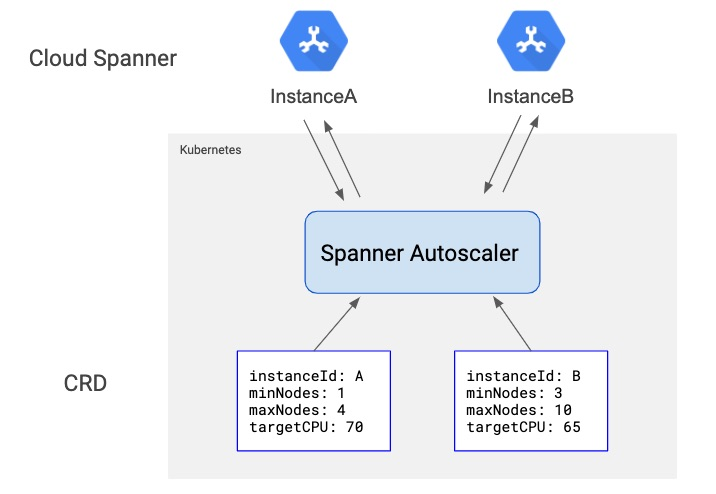
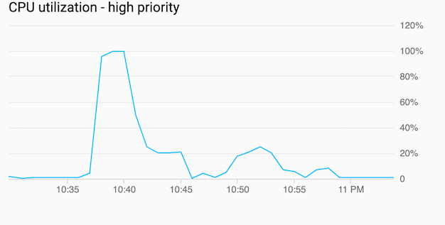
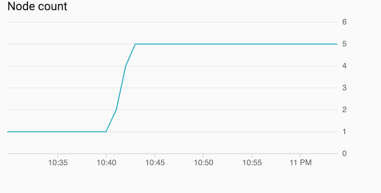
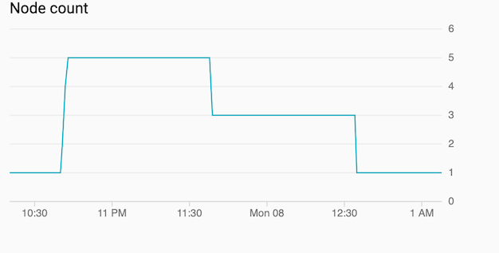

# Spanner Autoscaler

[![actions-workflow-test][actions-workflow-test-badge]][actions-workflow-test]
[![release][release-badge]][release]
[![license][license-badge]][license]

Spanner Autoscaler is a [Kubernetes Operator](https://coreos.com/operators/) to scale [Google Cloud Spanner](https://cloud.google.com/spanner/) automatically based on Cloud Spanner Instance CPU utilization like [Horizontal Pod Autoscaler](https://kubernetes.io/docs/tasks/run-application/horizontal-pod-autoscale/).

## Overview

[Cloud Spanner](https://cloud.google.com/spanner) is scalable.
When CPU utilization becomes high, we can [reduce it by increasing compute capacity](https://cloud.google.com/spanner/docs/cpu-utilization?hl=en#add-compute-capacity).

Spanner Autoscaler is created to reconcile Cloud Spanner compute capacity like [Horizontal Pod Autoscaler](https://kubernetes.io/docs/tasks/run-application/horizontal-pod-autoscale/) by configuring a compute capacity range and `targetCPUUtilization`.



When CPU Utilization(High Priority) is above (or below) `targetCPUUtilization`, Spanner Autoscaler tries to bring it back to the threshold by calculating desired compute capacity and then increasing (or decreasing) compute capacity.

 

The [pricing of Cloud Spanner](https://cloud.google.com/spanner/pricing) states that any compute capacity which is provisioned will be billed for a minimum of one hour, so Spanner Autoscaler maintains the increased compute capacity for about an hour. Spanner Autoscaler has `--scale-down-interval` flag (default: 55min) for achieving this.

While scaling down, removing large amounts of compute capacity at once (like 10000 PU -> 1000 PU) can cause a latency increase. Therefore, Spanner Autoscaler decreases the compute capacity in steps to avoid such large disruptions. This step size can be configured with the `scaledownStepSize` parameter (default: 2000 PU). Similarly, `scaleupStepSize` limits how much capacity can be added in a single scale-up operation (default: no limit). Both parameters accept either an integer number of Processing Units or a percentage of current capacity (e.g., `"10%"`).


Per-resource scale intervals can also be configured with `scaledownInterval` and `scaleupInterval` in the `scaleConfig` section, overriding the global `--scale-down-interval` and `--scale-up-interval` flags set on the controller.

### Scheduled scaling feature

If there are some batch jobs or any other compute intensive tasks which are run periodically on the Cloud Spanner, it is now possible to bump up the scaling range only for a specified duration. For example, the following `SpannerAutoscaleSchedule` will add an extra compute capacity of 600 Processing Units to the spanner instance every day at 2 o'clock, just for 3 hours:
```yaml
apiVersion: spanner.mercari.com/v1beta1
kind: SpannerAutoscaleSchedule
metadata:
  name: spannerautoscaleschedule-sample
  namespace: your-namespace
spec:
  targetResource: spannerautoscaler-sample
  additionalProcessingUnits: 600
  schedule:
    cron: "0 2 * * *"
    duration: 3h
```

The `cron` field supports extended syntax (`L`, `L-n`, `nW`, `LW`, `DAY#n`, `DAY#L`) in addition to the standard 5-field format, powered by [go-cron](https://github.com/netresearch/go-cron). See the [Extended Syntax documentation](https://pkg.go.dev/github.com/netresearch/go-cron#hdr-Extended_Syntax__Optional_) for details and examples.

> **Note:** While a schedule is active, `additionalProcessingUnits` is added to **both ends** of the autoscaling range: the effective range becomes `[spec.processingUnits.min + additionalProcessingUnits, spec.processingUnits.max + additionalProcessingUnits]` (exposed as `status.desiredMinPUs` / `status.desiredMaxPUs`). This means the instance can be scaled **beyond `spec.processingUnits.max`** — with `max: 1000` and the schedule above, the instance may reach 1,600 PU while the schedule is active. Because the lower bound is raised as well, the instance is scaled up to at least `min + additionalProcessingUnits` even when CPU utilization is low. Once the schedule's window (`duration`) ends, the range reverts to the values in `spec`, and the instance scales back down after the configured scale-down interval.

> **Note:** When multiple schedules are active simultaneously (i.e. their windows overlap), the `additionalProcessingUnits` from all active schedules are **summed** and added to both `desiredMinPUs` and `desiredMaxPUs`. For example, if schedule A adds +1,000 PU and schedule B adds +5,000 PU and both are active at the same time, `desiredMinPUs = spec.processingUnits.min + 6,000`.

### Scale down time restrictions

To prevent unexpected scale down operations during business hours or critical periods, you can restrict scale down operations to specific time windows using cron expressions. This feature allows you to limit scale downs to maintenance windows or low-traffic periods (such as late night hours).

```yaml
apiVersion: spanner.mercari.com/v1beta1
kind: SpannerAutoscaler
metadata:
  name: spannerautoscaler-sample
spec:
  scaleConfig:
    # Scale down only during late night hours (2:00 AM to 4:59 AM daily)
    scaledownAllowedTimes:
      - "* 2-4 * * *"
    # Other configuration...
```

For time windows that cross midnight (e.g., 11:00 PM to 5:59 AM), you can specify multiple cron expressions:

```yaml
scaledownAllowedTimes:
  - "* 23 * * *"     # 11:00 PM to 11:59 PM
  - "* 0-5 * * *"    # 12:00 AM to 5:59 AM
```

### Scale down forbidden times (blocklist approach)

Alternatively, you can prevent scale down operations during specific time periods using `scaledownNotAllowedTimes`. This is useful when you want to prevent scale downs during peak hours or critical business periods:

```yaml
apiVersion: spanner.mercari.com/v1beta1
kind: SpannerAutoscaler
metadata:
  name: spannerautoscaler-sample
spec:
  scaleConfig:
    # Prevent scale down during business hours (9:00 AM to 5:59 PM on weekdays)
    scaledownNotAllowedTimes:
      - "* 9-17 * * 1-5"
    # Other configuration...
```

For multiple forbidden periods, you can specify multiple cron expressions:

```yaml
scaledownNotAllowedTimes:
  - "* 12-13 * * 1-5"   # Lunch time on weekdays
  - "* 18-19 * * 1-5"   # Evening peak on weekdays
```

> **Note:** You can specify either `scaledownAllowedTimes` OR `scaledownNotAllowedTimes`, but not both. When neither is specified, scale down operations are allowed at any time (default behavior). Scale up operations are never restricted and will always be executed immediately when needed, regardless of time restrictions.

#### Cron Expression Format and Limitations

The cron expressions use the standard 5-field format: `minute hour day-of-month month day-of-week`. For example:
- `"* 2-4 * * *"` - Every minute from 2:00 AM to 4:59 AM daily
- `"0 9-17 * * 1-5"` - At minute 0 (top of the hour) from 9:00 AM to 5:00 PM on weekdays

**Important limitations:**
- **Hour-level precision only**: Time ranges are limited to full-hour boundaries. You cannot specify minute-level ranges like "3:15 AM to 8:40 AM".
- **Minute field applies to entire range**: If you specify a minute value (e.g., `"30 9-17 * * *"`), it applies to every hour in the range (9:30, 10:30, 11:30, etc.).
- **Use wildcard (*) for continuous coverage**: To allow scale-downs throughout an hour range, use `*` in the minute field.

For complex time requirements involving specific minutes, consider using multiple separate cron expressions or adjusting your maintenance windows to align with hour boundaries.

### Manual scaling override

For incident response or planned ramps, you can pin processing units to an explicit target via the `SpannerManualScaling` CRD. Manual scaling takes precedence over CPU- and schedule-driven autoscaling for as long as the override is active.

**The target can sit above or below the current processing units.** The controller picks the direction from the sign of `spec.processingUnits − status.currentProcessingUnits`, and the `scaleupStepSize` / `scaleupInterval` and `scaledownStepSize` / `scaledownInterval` fields pace each direction independently. By default both directions are accepted; cluster operators who want to forbid manual scale-down can run the controller with `--reject-manual-scaledown=true`, which lands those overrides in the `Invalid` phase.

Single-jump and stepped-ramp variants are both supported; the operational surface is intentionally just `kubectl create` / `kubectl delete` (spec is immutable, and the newest-`creationTimestamp` rule atomically supersedes older overrides).

```yaml
# Single-jump: target reached in one reconcile (no step size set).
apiVersion: spanner.mercari.com/v1beta1
kind: SpannerManualScaling
metadata:
  name: incident-2026-05-28
  namespace: production
spec:
  targetResource: spannerautoscaler-sample
  processingUnits: 7000
  expiresAt: "2026-05-29T10:00:00Z"   # or "2026-05-29T19:00:00+09:00" — same instant
```

See [`docs/manual-scaling.md`](./docs/manual-scaling.md) for the full lifecycle, stepped-ramp configuration (in either direction), modify-via-newest-wins examples, the `--reject-manual-scaledown` cluster policy, history-GC flag, RBAC, and a local kind + emulator end-to-end walkthrough.

## Installation

Spanner Autoscaler can be installed using [KPT](https://kpt.dev/installation/) by following 2 steps:

1. Deploy the operator through `kpt`

   ```console
   $ kpt pkg get https://github.com/mercari/spanner-autoscaler/config spanner-autoscaler-pkg
   $ kpt live init spanner-autoscaler-pkg/kpt
   $ kpt live install-resource-group

   ## Append '--dry-run' to the below line to just
   ## check the resources which will be created
   $ kustomize build spanner-autoscaler-pkg/kpt | kpt live apply -

   ## To uninstall, use the following
   $ kustomize build spanner-autoscaler-pkg/kpt | kpt live destroy -
   ```
   > :information_source: **TIP:** Instead of `kpt`, you can also use `kubectl` directly to install the resources (use `?ref=master` for latest version) as follows:
   >   ```console
   >   $ kustomize build "https://github.com/mercari/spanner-autoscaler.git/config/default?ref=v0.4.1" | kubectl apply -f -
   >   ```
   > These resources can then be adopted by `kpt` by using the `--inventory-policy=adopt` flag while using `kpt live apply` command. [More info](https://kpt.dev/reference/cli/live/apply/?id=flags).

1. Create a Custom Resource for managing a spanner instance

   ```console
   $ kubectl apply -f spanner-autoscaler-pkg/samples
   ```
   Examples of CustomResources can be found [below](#examples).\
   For authentication using a GCP service account JSON key, follow [these steps](#gcp-setup) to create a k8s secret with credentials.


## CRD reference

- [`SpannerAutoscaler` CRD reference](docs/crd-reference.md#spannerautoscaler)
- [`SpannerAutoscaleSchedule` CRD reference](docs/crd-reference.md#spannerautoscaleschedule)


## Examples

#### With custom step sizes and per-resource intervals:

```yaml
apiVersion: spanner.mercari.com/v1beta1
kind: SpannerAutoscaler
metadata:
  name: spannerautoscaler-sample
  namespace: your-namespace
spec:
  targetInstance:
    projectId: your-gcp-project-id
    instanceId: your-spanner-instance-id
  scaleConfig:
    processingUnits:
      min: 1000
      max: 10000
    scaledownStepSize: "20%"  # or an integer, e.g. 2000
    scaleupStepSize: "50%"    # or an integer, e.g. 3000; defaults to no limit
    scaledownInterval: 55m    # overrides --scale-down-interval for this resource
    scaleupInterval: 30s      # overrides --scale-up-interval for this resource
    targetCPUUtilization:
      highPriority: 60
```

#### Dual CPU scaling mode (highPriority + total):

Scale based on both High Priority and total CPU utilization simultaneously. The controller scales **out** when *either* metric exceeds its target (OR condition) and scales **in** only when *both* metrics are below their respective targets.

```yaml
apiVersion: spanner.mercari.com/v1beta1
kind: SpannerAutoscaler
metadata:
  name: spannerautoscaler-sample
  namespace: your-namespace
spec:
  targetInstance:
    projectId: your-gcp-project-id
    instanceId: your-spanner-instance-id
  scaleConfig:
    processingUnits:
      min: 1000
      max: 10000
    targetCPUUtilization:
      highPriority: 60  # required
      total: 65         # optional; enables dual-metric scaling when set
```

> **Note:** `highPriority` is **required**. `total` is optional — when omitted, scaling uses only the High Priority CPU metric. When both are specified, they use independent Cloud Monitoring metrics (`spanner.googleapis.com/instance/cpu/utilization_by_priority` for High Priority and `spanner.googleapis.com/instance/cpu/utilization` for total). The desired processing units for each metric are calculated independently (respecting `scaleupStepSize` / `scaledownStepSize`), and the **maximum** is applied. Scale-out fires when either metric exceeds its target; scale-in fires only when both are below their targets.

#### Restricting scale down to specific time windows:

```yaml
apiVersion: spanner.mercari.com/v1beta1
kind: SpannerAutoscaler
metadata:
  name: spannerautoscaler-sample
  namespace: your-namespace
spec:
  targetInstance:
    projectId: your-gcp-project-id
    instanceId: your-spanner-instance-id
  scaleConfig:
    processingUnits:
      min: 1000
      max: 10000
    # Allow scale down only during late night hours (2:00 AM to 4:59 AM daily)
    scaledownAllowedTimes:
      - "* 2-4 * * *"
    targetCPUUtilization:
      highPriority: 65
```

For time windows crossing midnight:

```yaml
apiVersion: spanner.mercari.com/v1beta1
kind: SpannerAutoscaler
metadata:
  name: spannerautoscaler-sample
  namespace: your-namespace
spec:
  targetInstance:
    projectId: your-gcp-project-id
    instanceId: your-spanner-instance-id
  scaleConfig:
    processingUnits:
      min: 1000
      max: 5000
    # Allow scale down from 11:00 PM to 5:59 AM daily (crossing midnight)
    scaledownAllowedTimes:
      - "* 23 * * *"     # 11:00 PM to 11:59 PM
      - "* 0-5 * * *"    # 12:00 AM to 5:59 AM
    targetCPUUtilization:
      total: 70
```

#### Timezone Support

Scale down time restrictions support timezone specification using the CRON_TZ format:

```yaml
apiVersion: spanner.mercari.com/v1beta1
kind: SpannerAutoscaler
metadata:
  name: spannerautoscaler-sample
  namespace: your-namespace
spec:
  targetInstance:
    projectId: your-gcp-project-id
    instanceId: your-spanner-instance-id
  scaleConfig:
    processingUnits:
      min: 1000
      max: 10000
    # Allow scale down only during late night hours in Tokyo timezone
    scaledownAllowedTimes:
      - "CRON_TZ=Asia/Tokyo * 2-4 * * *"
    targetCPUUtilization:
      highPriority: 65
```

When using CRON_TZ format, times are evaluated in the specified timezone rather than the controller's local timezone. This is useful for deployments where the controller runs in a different timezone than your business hours.

#### Single Service Account using Workload Identity:

```yaml
apiVersion: spanner.mercari.com/v1beta1
kind: SpannerAutoscaler
metadata:
  name: spannerautoscaler-sample
  namespace: your-namespace
spec:
  targetInstance:
    projectId: your-gcp-project-id
    instanceId: your-spanner-instance-id
  scaleConfig:
    processingUnits:
      min: 1000
      max: 4000
    scaledownStepSize: 1000
    targetCPUUtilization:
      highPriority: 60
```

#### Using Service Account JSON key for each `SpannerAutoscaler`:

```diff
  apiVersion: spanner.mercari.com/v1beta1
  kind: SpannerAutoscaler
  metadata:
    name: spannerautoscaler-sample
    namespace: your-namespace
  spec:
    targetInstance:
      projectId: your-gcp-project-id
      instanceId: your-spanner-instance-id
+   authentication:
+     iamKeySecret:
+       namespace: your-namespace
+       name: spanner-autoscaler-gcp-sa
+       key: service-account
    scaleConfig:
      processingUnits:
        min: 1000
        max: 4000
      scaledownStepSize: 1000
      targetCPUUtilization:
        highPriority: 60
```

#### Using Service Accounts with Workload Identity and impersonation:

```diff
  apiVersion: spanner.mercari.com/v1beta1
  kind: SpannerAutoscaler
  metadata:
    name: spannerautoscaler-sample
    namespace: your-namespace
  spec:
    targetInstance:
      projectId: your-gcp-project-id
      instanceId: your-spanner-instance-id
+   authentication:
+     impersonateConfig:
+       targetServiceAccount: GSA_SPANNER@TENANT_PROJECT.iam.gserviceaccount.com
    scaleConfig:
      processingUnits:
        min: 1000
        max: 4000
      scaledownStepSize: 1000
      targetCPUUtilization:
        highPriority: 60
```

> **Note:** `spec.targetInstance` (`projectId` and `instanceId`) is **immutable** after creation. To change the target Spanner instance, delete the `SpannerAutoscaler` and create a new one.

## GCP Setup

On your GCP project, you will need to enable `spanner.googleapis.com` and `monitoring.googleapis.com` APIs.

### Create service account

You will need to create at least one GCP service account, which will be used by the spanner-autoscaler controller to authenticate with GCP for modifying compute capacity of a Spanner instance. This service account should have the following roles:
  - `roles/spanner.admin` (on the Spanner instances)
  - `roles/monitoring.viewer` (on the project)

For fine grained access control, you should create one GCP service account per Spanner instance. This way, you will be able to specify a different service account in each of `SpannerAutoscaler` CRD resources you create later.

### Authenticate with service account JSON key

Generate a JSON key for the GCP service account (created [above](#create-service-account)) and put it in a Kubernetes Secret:
```sh
$ kubectl create secret generic spanner-autoscaler-gcp-sa --from-file=service-account=./service-account-key.json -n your-namespace
```
> :information_source: By default, `spanner-autoscaler` will have read access to `secret`s named `spanner-autoscaler-gcp-sa` in any namespace. If you wish to use a different name for your secret, then you need to explicitly create a `Role` and a `RoleBinding` ([example](/config/samples/rbac/role.yaml)) in your namespace. This will provide `spanner-autoscaler` with read access to any secret of your choice.

You can then refer to this secret in your `SpannerAutoscaler` CRD resource with `serviceAccountSecretRef` field [[example](#using-service-account-json-key-for-each-spannerautoscaler)].


### [Optional] Advanced methods for GCP authentication


Following are some other advanced methods which can also be used for GCP authentication:
<details> <summary>Details</summary>
<ul>

  #### Enable Workload Identity

  <details> <summary>Details</summary>

  You can configure the controller (`spanner-autoscaler-controller-manager`) to use [GKE Workload Identity](https://cloud.google.com/kubernetes-engine/docs/how-to/workload-identity) feature for key-less GCP access. Steps to do this:
  1. Enable Workload Identity on the GKE cluster - [Ref](https://cloud.google.com/kubernetes-engine/docs/how-to/workload-identity?hl=en#enable_on_cluster).
  1. Let's call the Kubernetes service account of the controller (`spanner-autoscaler/spanner-autoscaler-controller-manager`) as `KSA_CONTROLLER` and the GCP service account created [above](#create-service-account) as `GSA_CONTROLLER`.\
     Now configure Workload Identity between `KSA_CONTROLLER` and `GSA_CONTROLLER` with the following steps:
     1. Allow `KSA_CONTROLLER` to impersonate `GSA_CONTROLLER` by creating an IAM Policy binding:
        ```console
        $ gcloud iam service-accounts add-iam-policy-binding --role roles/iam.workloadIdentityUser --member "serviceAccount:PROJECT_ID.svc.id.goog[spanner-autoscaler/spanner-autoscaler-controller-manager]" GSA_CONTROLLER@PROJECT_ID.iam.gserviceaccount.com`
        ```
     1. Add annotation
        ```sh
        $ kubectl annotate serviceaccount  --namespace spanner-autoscaler spanner-autoscaler-controller-manager iam.gke.io/gcp-service-account=GSA_CONTROLLER@PROJECT_ID.iam.gserviceaccount.com`
        ```
  </details>
</ul>

<ul>

  #### Single service account with Workload Identity

  <details> <summary>Details</summary>

  The Kubernetes service account which is used for running the spanner-autoscaler controller can be bound to the GCP service account (created [above](#create-service-account)) through Workload Identity. If this is done, there is no need to provide `serviceAccountSecretRef` or `impersonateConfig` authentication parameters in the `spec` section of the `SpannerAutoscaler` CRD resources.

  An example for this is shown [here](#single-service-account-using-workload-identity).

  </details>
</ul>

<ul>

  #### Using service accounts with Workload Identity and Impersonation

  <details> <summary>Details</summary>

  In this method there are 3 service accounts involved (2 GCP service accounts and 1 Kubernetes service account):
  - `GSA_SPANNER`: The GCP Service Account (created [above](#create-service-account)) which has the correct permissions for modifying Spanner compute capacity
  - `GSA_CONTROLLER`: The GCP Service Account which is used for Workload Identity with the GKE cluster
  - `KSA_CONTROLLER`: The Kubernetes Service Account which is used for running the spanner-autoscaler controller pod in the GKE

  After enabling Workload Identity between `GSA_CONTROLLER` and `KSA_CONTROLLER`, you can configure `GSA_CONTROLLER` as `roles/iam.serviceAccountTokenCreator` of the `GSA_SPANNER` service account as follows:

  ```sh
  $ gcloud iam service-accounts add-iam-policy-binding $GSA_SPANNER --member=serviceAccount:$GSA_CONTROLLER --role=roles/iam.serviceAccountTokenCreator
  ```
  This will allow `KSA_CONTROLLER` to use `GSA_CONTROLLER` and impersonate (act as) `GSA_SPANNER` for a short period of time (by using a short-lived token). An example for this can be found [here](#using-service-accounts-with-workload-identity-and-impersonation).

  </details>
</ul>

<ul>

  **TIP:** Custom role with minimum permissions

  <details> <summary>Details</summary>

  Instead of predefined roles, you can define and use a [custom role](https://cloud.google.com/iam/docs/creating-custom-roles/?hl=en) with lesser privileges for Spanner Autoscaler. To scale the target Cloud Spanner instance, the weakest predefined role is [`roles/spanner.admin`](https://cloud.google.com/spanner/docs/iam?hl=en#roles). To observe the CPU usage metric of the project of the Spanner instance, the weakest predefined role is [`roles/monitoring.viewer`](https://cloud.google.com/monitoring/access-control?hl=en#monitoring_2).\
  The custom role can be created with just the following permissions:
  - `spanner.instances.get`
  - `spanner.instances.update`
  - `monitoring.timeSeries.list`

  </details>
</ul>

</details>


## Metrics

The controller exposes custom Prometheus metrics on the standard controller-runtime `/metrics` endpoint (bound to `--metrics-bind-address`, default `127.0.0.1:8080`). All business metrics carry the four identity labels `namespace`, `name`, `project_id`, `instance_id` so they can be sliced by either the Kubernetes resource identity or the target Spanner instance.

The endpoint can be scraped by Prometheus (`ServiceMonitor` / `PodMonitor`), the Datadog Agent's OpenMetrics check, VictoriaMetrics, Grafana Cloud, or any tool that consumes the Prometheus exposition format. No vendor-specific SDK is required.

### Available metrics

#### State (Gauge)

| Name | Extra labels | Description |
|---|---|---|
| `spanner_autoscaler_current_processing_units` | — | Current Spanner processing units. |
| `spanner_autoscaler_desired_processing_units` | — | Desired processing units computed in the latest reconcile. |
| `spanner_autoscaler_min_processing_units` | — | Configured `spec.scaleConfig.processingUnits.min`. |
| `spanner_autoscaler_max_processing_units` | — | Configured `spec.scaleConfig.processingUnits.max`. |
| `spanner_autoscaler_effective_min_processing_units` | — | Effective lower bound including additions from currently active schedules. |
| `spanner_autoscaler_effective_max_processing_units` | — | Effective upper bound including additions from currently active schedules. |
| `spanner_autoscaler_cpu_utilization` | `type=high_priority\|total` | Current CPU utilization percentage (0–100) per metric type. |
| `spanner_autoscaler_cpu_utilization_target` | `type=high_priority\|total` | Configured target CPU utilization percentage. |
| `spanner_autoscaler_instance_ready` | — | `1` when the Spanner instance state is `ready`, `0` otherwise. |
| `spanner_autoscaler_active_schedules` | — | Number of `SpannerAutoscaleSchedule` entries currently in effect. |
| `spanner_autoscaler_active_schedule_additional_pu` | — | Sum of `AdditionalPU` contributed by currently active schedules. |
| `spanner_autoscaler_last_scale_timestamp_seconds` | — | Unix timestamp of the last successful processing-units update. |
| `spanner_autoscaler_last_sync_timestamp_seconds` | — | Unix timestamp of the last successful Cloud Monitoring sync. |

#### Scaling events

| Name | Type | Extra labels | Description |
|---|---|---|---|
| `spanner_autoscaler_scale_events_total` | Counter | `direction=up\|down`, `driver=cpu_high_priority\|cpu_total\|schedule` | Successful processing-units updates. The `driver` label is a best-effort attribution to the metric (or schedule floor) that drove the decision. |
| `spanner_autoscaler_scale_skipped_total` | Counter | `reason` | Reconciles where scaling was skipped. Reasons: `same`, `scale_up_interval`, `scale_down_interval`, `scale_down_window`, `instance_not_ready`, `cpu_not_ready`. |
| `spanner_autoscaler_scale_pu_delta` | Histogram | `direction=up\|down` | Absolute processing-units change per scale event. Buckets: 100, 200, 500, 1000, 2000, 5000, 10000, 20000. |

#### Scheduled scaling

| Name | Extra labels | Description |
|---|---|---|
| `spanner_autoscaler_schedule_activations_total` | — | Number of cron firings that created an `ActiveSchedule` entry. |
| `spanner_autoscaler_schedule_deactivations_total` | `reason=expired\|unregistered` | Number of `ActiveSchedule` entries removed (by `EndTime` expiry or by schedule resource deletion). |

#### Operational (API quality)

| Name | Type | Extra labels | Description |
|---|---|---|---|
| `spanner_autoscaler_instance_update_total` | Counter | `result=success\|error` | Spanner `UpdateInstance` API call count. |
| `spanner_autoscaler_instance_update_duration_seconds` | Histogram | — | Latency of `UpdateInstance` calls. Buckets: 0.1, 0.5, 1, 2, 5, 10, 30, 60. |
| `spanner_autoscaler_metrics_fetch_total` | Counter | `result=success\|error` | Cloud Monitoring `GetInstanceMetrics` call count. |
| `spanner_autoscaler_metrics_fetch_duration_seconds` | Histogram | — | Latency of Cloud Monitoring fetches. Buckets: 0.05, 0.1, 0.25, 0.5, 1, 2, 5. |

The standard controller-runtime metrics (`controller_runtime_reconcile_*`, `workqueue_*`) and Go runtime metrics are also exposed on the same endpoint and are not duplicated here.

### Example PromQL queries

```promql
# Gap between desired and current PU (scaling lag).
spanner_autoscaler_desired_processing_units - spanner_autoscaler_current_processing_units

# UpdateInstance error rate over the last 5 minutes.
sum(rate(spanner_autoscaler_instance_update_total{result="error"}[5m]))
  /
sum(rate(spanner_autoscaler_instance_update_total[5m]))

# Scale-up frequency by driver over the last hour.
sum by (driver) (rate(spanner_autoscaler_scale_events_total{direction="up"}[1h]))

# Cloud Monitoring fetch p99 latency.
histogram_quantile(0.99, sum by (le) (rate(spanner_autoscaler_metrics_fetch_duration_seconds_bucket[5m])))

# Autoscalers pinned at their effective max for 5+ minutes.
max_over_time(
  (spanner_autoscaler_current_processing_units
    == bool spanner_autoscaler_effective_max_processing_units)[5m:1m]
) == 1
```

## Development and Contribution

See [docs/development.md](docs/development.md) and [CONTRIBUTING.md](.github/CONTRIBUTING.md) respectively.

The recommended local development workflow uses [Tilt](https://tilt.dev) with local Spanner and Cloud Monitoring emulators — no real GCP credentials required:

```console
$ make tilt-up   # creates a kind cluster and starts Tilt
$ make tilt-down # tears everything down (Tilt, emulators, kind cluster, webhook certs)
```

Tilt automatically starts the emulators, installs cert-manager, deploys the webhook configuration, and runs the controller locally. Changes to any Go file under `cmd/`, `api/`, or `internal/` trigger a live reload. Running `make tilt-up` after `make tilt-down` starts from a completely clean state.

### :information_source: Migration from `0.3.0` to `0.4.0`:

The older version `0.3.0` (with `apiVersion: spanner.mercari.com/v1alpha1`) is now deprecated in favor of `0.4.0` (with `apiVersion: spanner.mercari.com/v1beta1`).

Version `0.4.0` is backward compatible with `0.3.0`, but there is a restructuring of the `SpannerAutoscaler` resource definition and names of many fields have changed. Thus it is recommended to go through the [`SpannerAutoscaler` CRD reference](docs/crd-reference.md#spannerautoscaler) and replace `v1alpha1` resources with `v1beta1` spec definition.

### :warning: Migration from `0.6.x` to `0.7.x`:

**Breaking change:** `targetCPUUtilization.highPriority` is now **required**. Configurations that set only `targetCPUUtilization.total` (without `highPriority`) are no longer valid and will be rejected by the webhook.

To migrate:
- If you were using only `total`, add a `highPriority` target. The controller will now scale out when *either* metric exceeds its target and scale in only when *both* are below their targets.
- If you were using only `highPriority`, no change is required.

### :information_source: Migration from `0.7.x` to `0.8.x`:

The `--config` flag has been removed (`ControllerManagerConfig` was dropped upstream in `controller-runtime` v0.19). Deployments still passing `--config=...` will fail to start with `flag provided but not defined: -config`.

The values previously in `controller_manager_config.yaml` are now flag defaults in the binary (`--health-probe-bind-address=:8081`, `--metrics-bind-address=127.0.0.1:8080`, `--leader-elect=true`, `--leader-elect-id=54b82eb3.mercari.com`), so behavior is preserved. The `controller_manager_config.yaml` ConfigMap and the `manager_config_patch.yaml` kustomize patch have been deleted — remove any references in downstream overlays. To override the defaults, pass the flag in the manager Deployment's `args:` list (see `config/manager/manager.yaml`). CRDs are unchanged.

## License

Spanner Autoscaler is released under the [Apache License 2.0](./LICENSE).

:warning: **NOTE:**

1. This project is currently in active development phase and there might be some backward incompatible changes in future versions.
1. Spanner Autoscaler supports scaling based on `High Priority` CPU utilization (`targetCPUUtilization.highPriority`, required) and optionally total CPU utilization (`targetCPUUtilization.total`). When both are set, the controller scales out on either metric exceeding its target and scales in only when both are below their targets. It doesn't watch `Low Priority` CPU utilization or Rolling average 24-hour utilization.
1. It doesn't check [the storage size and the number of databases](https://cloud.google.com/spanner/quotas?hl=en#database_limits) as well. You must take care of these metrics by yourself.


:information_source: More information and background of spanner-autoscaler is available on [this blog](https://engineering.mercari.com/en/blog/entry/20211222-kubernetes-based-spanner-autoscaler)!

<!-- badge links -->

[actions-workflow-test]: https://github.com/mercari/spanner-autoscaler/actions?query=workflow%3ATest
[actions-workflow-test-badge]: https://img.shields.io/github/workflow/status/mercari/spanner-autoscaler/Test?label=Test&style=for-the-badge&logo=github

[release]: https://github.com/mercari/spanner-autoscaler/releases
[release-badge]: https://img.shields.io/github/v/release/mercari/spanner-autoscaler?style=for-the-badge&logo=github

[license]: LICENSE
[license-badge]: https://img.shields.io/github/license/mercari/spanner-autoscaler?style=for-the-badge
