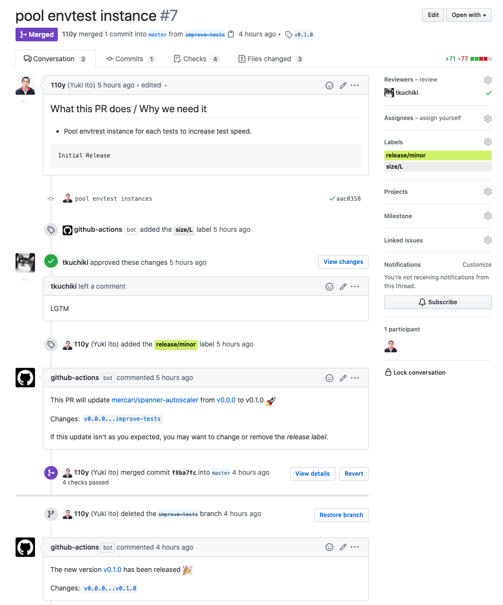

# Releasing

In Spanner Autoscaler, we update Git tags, GitHub Releases, and Docker images with GitHub Actions.

## How to update the version?

1. Add `release/{major,minor,patch}` label to a PR depending on the desired update.

    

1. Get an approval from owners and then merge the PR.
1. GitHub Actions automatically update and push a Git tag, create a GitHub Release, and build and push a Docker image.

For further details, see [the release workflow](../.github/workflows/release.yml).
